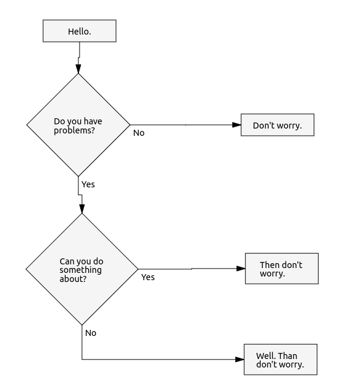

# Drawdown Parser
Parser for Drawdown markup.

Let's say you're typing a lot of documentation in Markdown format and you always feel stupid when you have to draw diagrams in а completely different application, export images and link them back into your Markdown document. That's why this parser exists. Now you can type your diagrams directly in your markdown and with the right tools and plugins your IDE can visualize them in a shmancy-fancy way. On top of the pretty easy diagram creation you will get real versioning of your documentation.

## Syntax example
Since this drawdown "language" is a garage invention, we are not going into big details, instead let's look at this example of Flow chart syntax.

In your markdown you can open block code 


    ```drawdown.flow.my-first-diagram

    - Hello.
    - Do you have problems?
    - Yes:
      - Can you do something about them?
      - Yes:
        - Then don't worry.
      - No:
        - Well\. Then don't worry.
    - No:
      - Don't worry.

    ```

With the proper use of the parser and the dedicated [drawdown renderer][6f03d088] this can produce an interactive SVG diagram which will look something like:

[6f03d088]: https://github.com/lyubo-slavilov/drawdown-svg-render "drawdown-svg-render"



## Installation

You can use NPM to install the parser

```bash
$ npm install drawdown-parser --save
```

## Usage
Let's say you had already installed the [drawdown renderer][6f03d088]

```bash
$ npm install drawdown-svg-render --save
```

And let's say somehow you had already extracted the `block code` for the drawdown scripts. What you can do with the parser is:

```javascript
import { factory } from 'drawdown-parser';
import { Renderer } from 'drawdown-svg-render';

const script = /* whatever your routine here is */;
const diagramObject = factory('flow').parseText(script);
const renderer = new Renderer();

renderer.render(document.body, diagramObject);
```
This will render the interactive SVG diagram into the `body` of your HTML document.

The important bit from the perspective of the parser is:

```javascript
const diagramObject = factory('flow').parseText(script);
```

As you see we are using a  `Parser Factory` in order to instantiate our parser. Once we have it we can call the `parseText()` method to produce the object representation of the diagram.

The above code can be written more verbose like this:

```javascript
import { factory } from 'drawdon-parser';

/* ... */

const flowParser = factory('flow');
const diagramObject = flowParser.parseText(script);

/* ... */
```
## API
Sorry. It is in TODO.

## Demo
Sorry. It is in TODO also.
